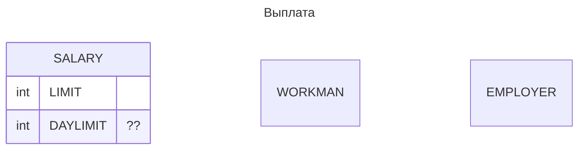

- Пользователь
- Сотрудник
- Зарплата
- Лимит на выплату
- Работодатель
- Супервайзер
- Внешний табель
- Рабочий день

- Заявка на выплату
- Заявка на участие в программе

- Плательщик
- Получатель платежа
- Счет


```mermaid
---
title: Вшешний табель
---

erDiagram


    EMPLOYER 1 .. 0+ TABEL : "owns"
    EMPLOYER 1 to 0+ WORKMAN : "hire"
    EMPLOYER 1 to 0+ SUPERVISOR : "hire"

    WORKMAN 1 to 1 TABEL : "has"
    TABEL 1 to 0+ WORKDAY: "contains"

    SUPERVISED_GROUP 1 to 0+ WORKMAN : "contains"

    SUPERVISOR 1 to 0+ SUPERVISED_GROUP : "controls"
    SUPERVISOR 1 .. 0+ TABEL : "edit"


    WORKDAY {
        date Date
        bool status
        string comment
    }

    TABEL {
        id WORKMAN
        array WORKDAYS
    }

    AGREGATE_TABEL 1 to 0+ TABEL : "agregate???"

```


