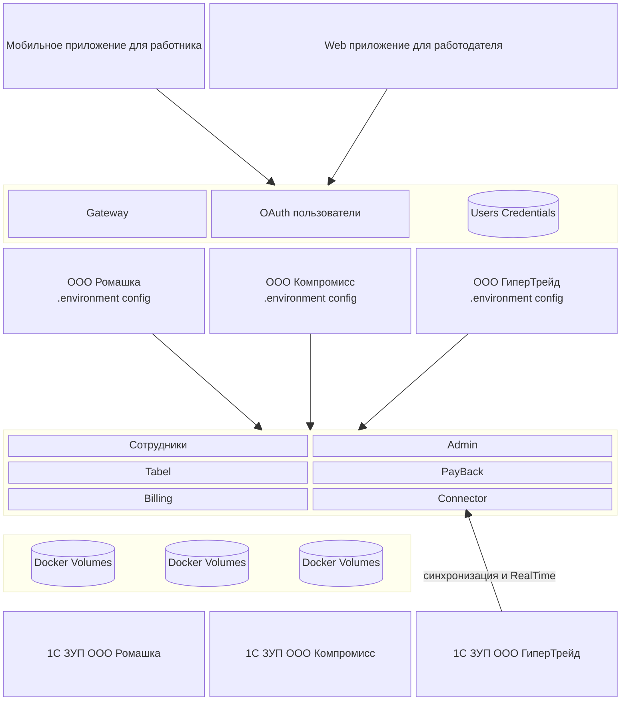

```mermaid


block-beta
    columns 3

    Mobile["Мобильное приложение для работника"]
    EmployerFrontend["Web приложение для работодателя"]:2
    space:3

    block:paypeople:3
        columns 4
        Gateway
        OAuth["OAuth пользователи"]
        Authenitcation[("Users Credentials")]
    end

    App1["ООО Ромашка<br/>.environment config"]
    App2["ООО Компромисс<br/>.environment config"]
    App3["ООО ГиперТрейд<br/>.environment config"] 

    space:3

    block:modules:3
        columns 2       
        Сотрудники Admin Tabel PayBack Billing Connector
    end

    block:volumes:2
        DB1[("Docker Volumes")] 
        DB2[("Docker Volumes")]
        DB3[("Docker Volumes")]
    end

    space

    ЗУП1["1C ЗУП ООО Ромашка"]
    ЗУП2["1C ЗУП ООО Компромисс"]
    ЗУП3["1C ЗУП ООО ГиперТрейд"]

    Mobile --> paypeople
    EmployerFrontend --> paypeople

    App1 --> modules
    App2 --> modules
    App3 --> modules

    ЗУП3 -- "синхронизация и RealTime" --> Connector
```