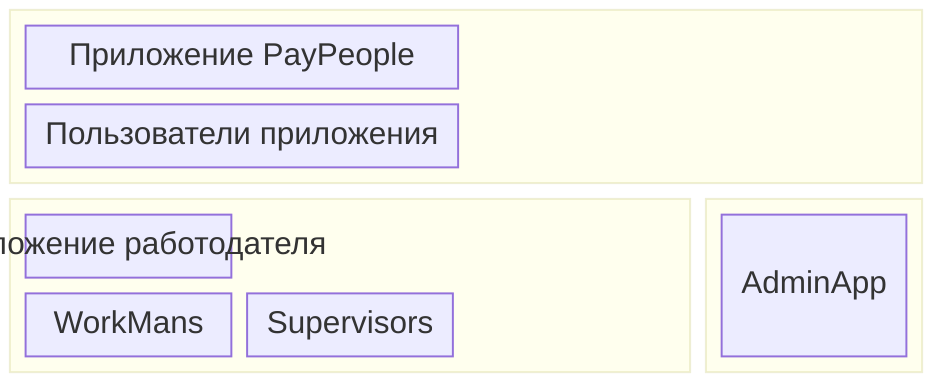

```mermaid


block-beta
    columns 4
    
    block:gr1:4
        columns 2
        PayPeople["Приложение PayPeople"]:2
        Users["Пользователи приложения"]
    end

    block:gr2:3
        columns 3
        EmployerAppN["Приложение работодателя"]:3
        WorkMans Supervisors
    end

    block:gr3:1
        columns 3
        AdminApp
        
    end

```