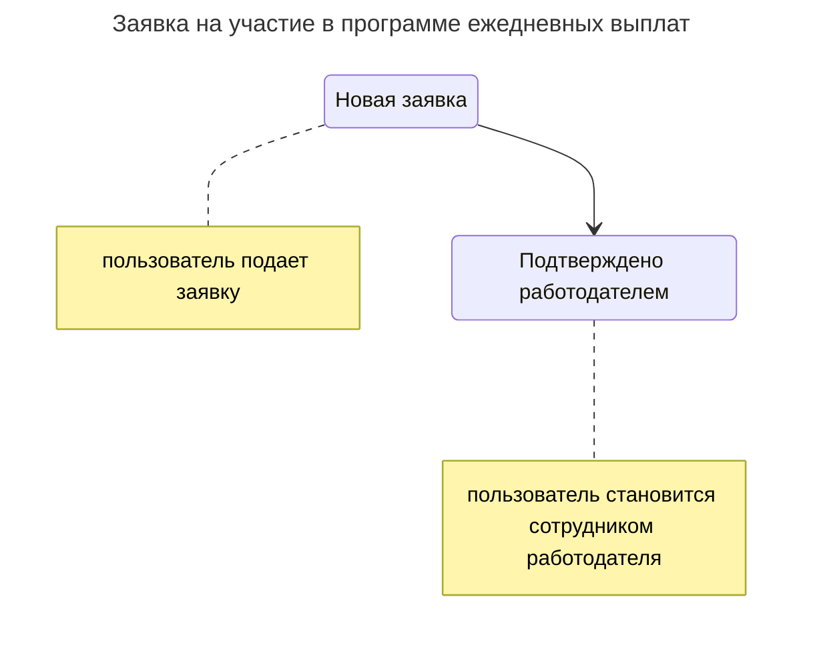
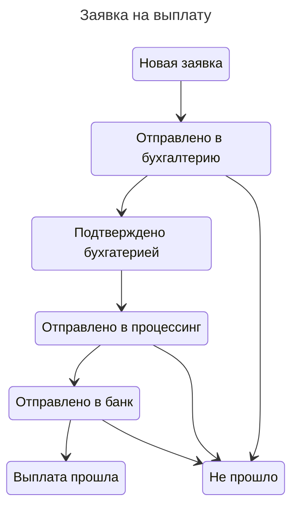

```mermaid
---
title: Заявка на участие в программе ежедневных выплат
---

stateDiagram
    New: Новая заявка
    Approved: Подтверждено работодателем

    Note right of New : пользователь подает заявку

    Note right of Approved : пользователь становится сотрудником работодателя

    New --> Approved
    
```

```mermaid
---
title: Заявка на выплату
---

stateDiagram
    New: Новая заявка
    BuhApprove: Отправлено в бухгалтерию
    Approved: Подтверждено бухгатерией
    Processing: Отправлено в процессинг
    Bank: Отправлено в банк
    Success: Выплата прошла
    Fail: Не прошло


    New --> BuhApprove
    BuhApprove --> Approved
    Approved --> Processing
    Processing --> Bank
    Bank --> Success

    BuhApprove --> Fail
    Processing --> Fail
    Bank --> Fail


    
```