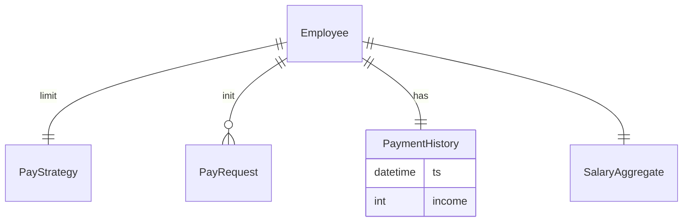
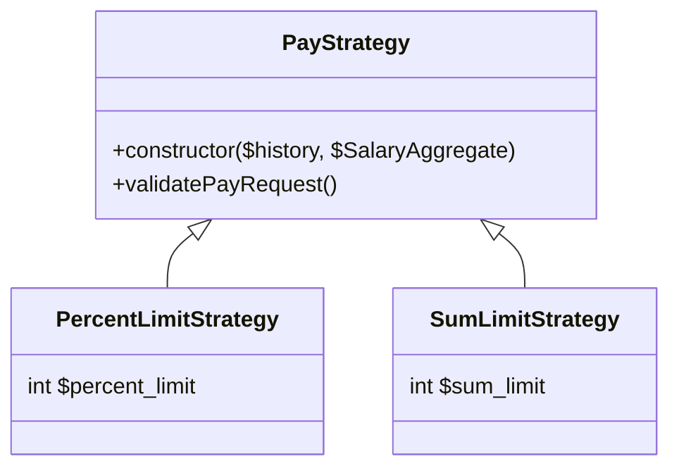
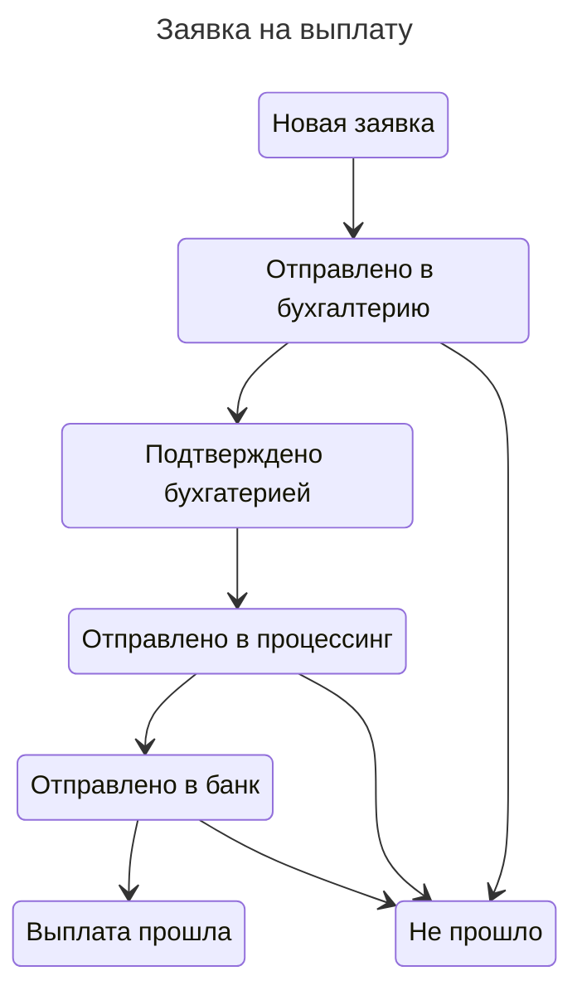

- Наемный работник
- Зарплата
- Лимит выплат
- Запрос на выплату

```mermaid

erDiagram
    
    Employee 1 to 1 PayStrategy : "limit"
    Employee 1 to 0+ PayRequest: "init"
    Employee 1 to 1 PaymentHistory: "has"
    Employee 1 to 1 SalaryAggregate: ""

    PaymentHistory {
        datetime ts
        int income    
    }   

```

```mermaid

classDiagram

    class PayStrategy {
        +constructor($history, $SalaryAggregate)
        +validatePayRequest()

    }
    

    PercentLimitStrategy: int $percent_limit
    SumLimitStrategy: int $sum_limit


    PayStrategy <|-- PercentLimitStrategy
    PayStrategy <|-- SumLimitStrategy
 

```

```mermaid
---
title: Заявка на выплату
---

stateDiagram
    New: Новая заявка
    BuhApprove: Отправлено в бухгалтерию
    Approved: Подтверждено бухгатерией
    Processing: Отправлено в процессинг
    Bank: Отправлено в банк
    Success: Выплата прошла
    Fail: Не прошло


    New --> BuhApprove
    BuhApprove --> Approved
    Approved --> Processing
    Processing --> Bank
    Bank --> Success

    BuhApprove --> Fail
    Processing --> Fail
    Bank --> Fail

    
```