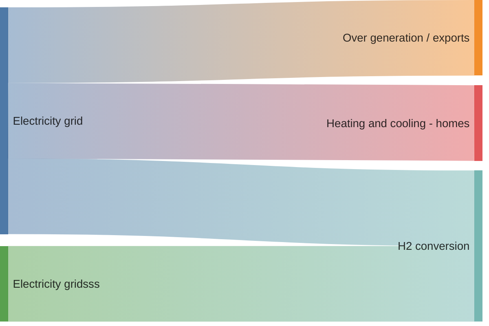

# OK
- 1
- 2
- 3 


```mermaid
---
title: Order example
---
erDiagram

    ORDER 1 .. 1 ITEM : ok

    CUSTOMER {
        string FIO
        USER account

    }

    ORDER 0+ to 1+ FOOBAR : kk

```


